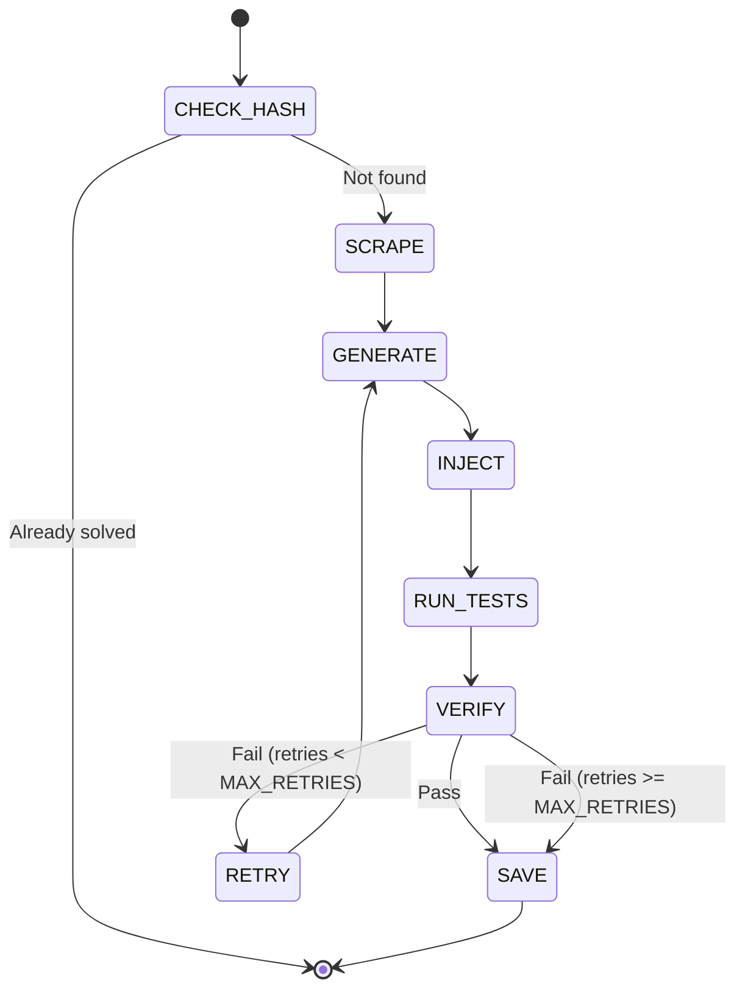

# LeetCode Auto-Solver Agent - System Design Document

## Executive Summary

The LeetCode Auto-Solver is an autonomous agentic system that solves LeetCode problems without human intervention. It orchestrates browser automation (Selenium), AI reasoning (Gemini-1.5-Flash), and persistent storage (JSON) to read problems, generate solutions, test code, and save results.

**Key Characteristics:**
- **Idempotent**: Can restart without re-solving completed problems
- **Stateless Controller**: Orchestrator has no domain logic
- **Hash-Based Caching**: Prevents redundant API calls and browser actions
- **Self-Correcting**: Optional retry loop on test failures
- **Human-in-the-Loop Ready**: Designed for optional human verification

---

## 1. Architecture Overview

### 1.1 System Layers

```
┌─────────────────────────────────────────────────────────────┐
│                     CONTROLLER LAYER                        │
│                        (main.py)                            │
│  ┌──────────────────────────────────────────────────────┐  │
│  │ State Machine: Check → Scrape → Generate → Test     │  │
│  │               → Verify → Submit → Save               │  │
│  └──────────────────────────────────────────────────────┘  │
└────────┬──────────────────┬──────────────────┬─────────────┘
         │                  │                  │
         ▼                  ▼                  ▼
┌─────────────────┐ ┌─────────────────┐ ┌─────────────────┐
│  PERCEPTION/    │ │   INTELLIGENCE  │ │  PERSISTENCE    │
│    ACTION       │ │     LAYER       │ │     LAYER       │
│  (browser.py)   │ │   (brain.py)    │ │  (memory.py)    │
├─────────────────┤ ├─────────────────┤ ├─────────────────┤
│ • Selenium      │ │ • Gemini API    │ │ • JSON Store    │
│ • DOM Parser    │ │ • Prompt Eng.   │ │ • Hash Map      │
│ • Code Inject   │ │ • Code Gen.     │ │ • CRUD Ops      │
│ • Result Read   │ │ • Retry Logic   │ │ • Validation    │
└─────────────────┘ └─────────────────┘ └─────────────────┘
         │                  │                  │
         ▼                  ▼                  ▼
┌─────────────────┐ ┌─────────────────┐ ┌─────────────────┐
│   LeetCode UI   │ │  Gemini-1.5-    │ │  problems.json  │
│  (Monaco Editor)│ │     Flash       │ │   {slug: {...}} │
└─────────────────┘ └─────────────────┘ └─────────────────┘
```

### 1.2 Data Flow Sequence

```
┌─────┐  1. Get URL   ┌─────────┐
│User │──────────────▶│ main.py │
└─────┘               └────┬────┘
                           │ 2. Extract slug
                           ▼
                      ┌─────────┐
                      │memory.py│◀─── Check if solved
                      └────┬────┘
                           │ 3. Not found
                           ▼
                      ┌──────────┐
                      │browser.py│◀─── Scrape problem
                      └────┬─────┘
                           │ 4. Description
                           ▼
                      ┌─────────┐
                      │ brain.py│◀─── Generate code
                      └────┬────┘
                           │ 5. Python code
                           ▼
                      ┌──────────┐
                      │browser.py│◀─── Inject & Run
                      └────┬─────┘
                           │ 6. Result
                           ▼
                      ┌─────────┐
                      │memory.py│◀─── Save result
                      └─────────┘
```

### 1.3 Technology Stack

| Layer | Technology | Version/Model | Purpose |
|-------|-----------|---------------|----------|
| Controller | Python | 3.11+ | Orchestration |
| Browser | Selenium | 4.x | WebDriver automation |
| AI Brain | Gemini | 1.5-Flash | Code generation |
| Storage | JSON | Native | Persistence |
| Protocol | Chrome DevTools | Port 9222 | Cloudflare bypass |

---

## 2. Component Specifications

### 2.1 Controller (main.py)

**Responsibility:** State machine orchestration without domain logic

#### 2.1.1 Core Functions

```python
def main():
    """Entry point: Initialize and run solver loop"""
    # Load environment variables
    # Initialize Selenium connection to Chrome DevTools (127.0.0.1:9222)
    # Load memory database
    # Run solver loop
    pass

def solve_problem(problem_url: str) -> dict:
    """Main state machine for solving a single problem
    
    States:
    1. CHECK_HASH: Query memory for existing solution
    2. SCRAPE: Extract problem description from DOM
    3. GENERATE: Call AI to generate solution code
    4. INJECT: Insert code into Monaco editor
    5. RUN_TESTS: Submit and wait for test results
    6. VERIFY: Parse result (pass/fail)
    7. SAVE: Persist to memory
    8. (Optional) RETRY: If failed, regenerate with error context
    
    Returns:
        dict: {"slug": str, "status": str, "code": str, "timestamp": str}
    """
    pass

def extract_problem_slug(url: str) -> str:
    """Extract problem identifier from LeetCode URL
    
    Examples:
        https://leetcode.com/problems/two-sum/ → 'two-sum'
        https://leetcode.com/problems/add-two-numbers/description/ → 'add-two-numbers'
    """
    pass
```

#### 2.1.2 Configuration

```python
# Environment Variables (from .env)
CHROME_DEBUGGER_URL = "127.0.0.1:9222"  # Chrome DevTools endpoint
GEMINI_API_KEY = "sk-emergent-..."       # Emergent LLM key
MEMORY_FILE = "./data/problems.json"    # JSON database path
MAX_RETRIES = 2                          # Retry attempts on test failure
RESULT_TIMEOUT = 30                      # Seconds to wait for test results
```

#### 2.1.3 Error Handling

| Error Type | Handling Strategy |
|------------|-------------------|
| Hash miss | Proceed to SCRAPE state |
| Scrape failure | Log error, skip problem |
| AI timeout | Retry with exponential backoff |
| Injection failure | Retry once, then fail |
| Test timeout | Mark as "timeout", save partial result |
| Memory write error | Log error, continue (in-memory fallback) |

#### 2.1.4 State Transitions



---

### 2.2 Perception/Action Layer (browser.py)

**Responsibility:** Selenium-based browser automation for LeetCode UI

#### 2.2.1 Core Functions

```python
class LeetCodeBrowser:
    def __init__(self, debugger_url: str):
        """Connect to existing Chrome instance via DevTools Protocol
        
        Args:
            debugger_url: Chrome DevTools endpoint (e.g., '127.0.0.1:9222')
        """
        pass
    
    def scrape_problem_description(self, problem_url: str) -> str:
        """Extract problem description from LeetCode problem page
        
        Steps:
        1. Navigate to problem URL
        2. Wait for DOM element: .elfjS (problem description container)
        3. Extract text content
        4. Clean HTML tags and normalize whitespace
        
        Returns:
            str: Raw problem description text
        
        Raises:
            TimeoutException: If DOM element not found within 10s
            NoSuchElementException: If description container missing
        """
        pass
    
    def inject_code(self, code: str) -> bool:
        """Inject Python code into Monaco editor
        
        Steps:
        1. Wait for Monaco editor to load
        2. Focus editor with click
        3. Select all (Ctrl+A)
        4. Delete existing code
        5. Paste new code
        
        Args:
            code: Python solution code (no markdown formatting)
        
        Returns:
            bool: True if injection successful
        
        Raises:
            ElementNotInteractableException: If editor not ready
        """
        pass
    
    def run_tests(self) -> None:
        """Click 'Run' button to execute test cases
        
        Steps:
        1. Locate 'Run' button (data-e2e-locator='console-run-button')
        2. Click button
        3. Wait for loading state to clear
        """
        pass
    
    def get_test_result(self, timeout: int = 30) -> dict:
        """Poll for test result and parse outcome
        
        Steps:
        1. Wait for result div to appear (max timeout seconds)
        2. Check result status:
           - Green background + 'Accepted' → Pass
           - Red background + 'Wrong Answer' → Fail
        3. Extract test case details if failed
        
        Returns:
            dict: {
                "status": "pass" | "fail" | "timeout",
                "message": str,  # Error details if failed
                "test_cases": list  # Failed test case info
            }
        
        Raises:
            TimeoutException: If result not ready within timeout
        """
        pass
    
    def submit_solution(self) -> bool:
        """Click 'Submit' button to finalize solution
        
        Returns:
            bool: True if submission successful
        """
        pass
    
    def close(self):
        """Close browser connection (do not quit Chrome process)"""
        pass
```

#### 2.2.2 DOM Selectors

| Element | Selector | Purpose |
|---------|----------|----------|
| Problem Description | `.elfjS, .content__u3I1` | Main problem text |
| Monaco Editor | `.monaco-editor, .view-lines` | Code input area |
| Run Button | `[data-e2e-locator='console-run-button']` | Execute tests |
| Submit Button | `[data-e2e-locator='console-submit-button']` | Final submission |
| Result Container | `[data-e2e-locator='submission-result']` | Test outcome |
| Status Text | `.result-status` | Pass/Fail indicator |

#### 2.2.3 Timing Configuration

```python
WAIT_TIMEOUTS = {
    "page_load": 10,        # Wait for initial page load
    "editor_ready": 5,      # Monaco editor initialization
    "test_execution": 30,   # Test run completion
    "result_appear": 30,    # Result div appearance
    "submit_confirm": 10    # Submission confirmation
}

POLLING_INTERVALS = {
    "result_check": 0.5     # Poll every 500ms for results
}
```

#### 2.2.4 Chrome DevTools Setup

```python
from selenium import webdriver
from selenium.webdriver.chrome.options import Options

def connect_to_chrome(debugger_url: str) -> webdriver.Chrome:
    """Connect to existing Chrome instance
    
    Prerequisites:
    - Chrome must be launched with: 
      chrome --remote-debugging-port=9222 --user-data-dir=/tmp/chrome-profile
    
    Args:
        debugger_url: DevTools endpoint (e.g., '127.0.0.1:9222')
    
    Returns:
        webdriver.Chrome: Connected driver instance
    """
    options = Options()
    options.add_experimental_option("debuggerAddress", debugger_url)
    driver = webdriver.Chrome(options=options)
    return driver
```

---

### 2.3 Intelligence Layer (brain.py)

**Responsibility:** Gemini-1.5-Flash integration for code generation

#### 2.3.1 Core Functions

```python
from emergentintegrations.llm.chat import LlmChat, UserMessage
import asyncio

class CodeBrain:
    def __init__(self, api_key: str):
        """Initialize Gemini chat client
        
        Args:
            api_key: Emergent LLM key for Gemini access
        """
        self.chat = LlmChat(
            api_key=api_key,
            session_id="leetcode-solver",
            system_message=self._get_system_prompt()
        ).with_model("gemini", "gemini-3-flash-preview")
    
    def _get_system_prompt(self) -> str:
        """Define AI behavior for code generation
        
        Critical requirements:
        - Output ONLY raw Python code (no markdown, no ```python```)
        - Use LeetCode's function signature exactly as provided
        - Include minimal comments
        - Optimize for correctness first, then efficiency
        """
        return """
You are a LeetCode solution generator. Your ONLY job is to write Python code that solves the given problem.

RULES:
1. Output ONLY the function implementation - no markdown, no explanations
2. Use the exact function signature from the problem
3. Do NOT include test cases or example usage
4. Write clean, efficient code with minimal comments
5. Handle edge cases (empty input, single element, etc.)

Format:
class Solution:
    def functionName(self, param1: Type, param2: Type) -> ReturnType:
        # Your implementation here
        pass
"""
    
    async def generate_solution(self, problem_description: str, retry_context: str = None) -> str:
        """Generate Python solution for LeetCode problem
        
        Args:
            problem_description: Full problem text from LeetCode
            retry_context: Optional error message from failed test (for retry)
        
        Returns:
            str: Raw Python code (no markdown formatting)
        
        Raises:
            APIError: If Gemini API fails
            ValueError: If response is not valid Python code
        """
        prompt = self._build_prompt(problem_description, retry_context)
        user_message = UserMessage(text=prompt)
        response = await self.chat.send_message(user_message)
        
        # Clean response (remove markdown if present despite system prompt)
        code = self._clean_code_response(response)
        return code
    
    def _build_prompt(self, description: str, retry_context: str = None) -> str:
        """Construct prompt for AI
        
        Args:
            description: Problem statement
            retry_context: Error message from previous attempt (if retry)
        
        Returns:
            str: Complete prompt for Gemini
        """
        if retry_context:
            return f"""
Your previous solution failed with this error:
{retry_context}

Please fix the solution for this problem:
{description}

Remember: Output ONLY raw Python code.
"""
        else:
            return f"""
Solve this LeetCode problem:
{description}

Output ONLY the Python function implementation.
"""
    
    def _clean_code_response(self, response: str) -> str:
        """Remove markdown formatting if present
        
        Args:
            response: Raw API response
        
        Returns:
            str: Clean Python code
        """
        # Remove ```python and ``` markers
        code = response.strip()
        if code.startswith("```python"):
            code = code[9:]  # Remove ```python
        if code.startswith("```"):
            code = code[3:]  # Remove ```
        if code.endswith("```"):
            code = code[:-3]  # Remove trailing ```
        return code.strip()
```

#### 2.3.2 Rate Limiting Strategy

```python
import time
from functools import wraps

def rate_limit(max_calls: int, period: int):
    """Decorator to limit API calls
    
    Args:
        max_calls: Maximum calls allowed in period
        period: Time window in seconds
    """
    calls = []
    
    def decorator(func):
        @wraps(func)
        async def wrapper(*args, **kwargs):
            now = time.time()
            # Remove calls outside current window
            while calls and calls[0] < now - period:
                calls.pop(0)
            
            if len(calls) >= max_calls:
                sleep_time = period - (now - calls[0])
                await asyncio.sleep(sleep_time)
            
            calls.append(now)
            return await func(*args, **kwargs)
        return wrapper
    return decorator

# Apply to generate_solution:
@rate_limit(max_calls=10, period=60)  # 10 calls per minute
async def generate_solution(...):
    ...
```

#### 2.3.3 Error Handling

| Error Type | Recovery Strategy |
|------------|-------------------|
| API Timeout | Retry with exponential backoff (max 3 attempts) |
| Rate Limit | Wait for rate limit window to reset |
| Invalid Response | Parse error, request regeneration |
| Network Error | Retry after 5 seconds |
| Quota Exceeded | Log error, halt execution |

---

### 2.4 Persistence Layer (memory.py)

**Responsibility:** JSON-based hash map for solved problems

#### 2.4.1 Core Functions

```python
import json
import os
from datetime import datetime, timezone
from typing import Optional
import threading

class MemoryStore:
    def __init__(self, file_path: str):
        """Initialize JSON database
        
        Args:
            file_path: Path to problems.json file
        """
        self.file_path = file_path
        self.lock = threading.Lock()  # Thread-safe operations
        self._ensure_file_exists()
    
    def _ensure_file_exists(self):
        """Create empty JSON file if not exists"""
        if not os.path.exists(self.file_path):
            os.makedirs(os.path.dirname(self.file_path), exist_ok=True)
            with open(self.file_path, 'w') as f:
                json.dump({}, f)
    
    def get(self, problem_slug: str) -> Optional[dict]:
        """Retrieve problem record by slug
        
        Args:
            problem_slug: LeetCode problem identifier (e.g., 'two-sum')
        
        Returns:
            dict or None: Problem record if exists, else None
            {
                "slug": str,
                "status": "pass" | "fail" | "timeout",
                "code": str,
                "timestamp": str (ISO 8601),
                "attempts": int
            }
        """
        with self.lock:
            with open(self.file_path, 'r') as f:
                data = json.load(f)
            return data.get(problem_slug)
    
    def save(self, problem_slug: str, status: str, code: str, attempts: int = 1) -> bool:
        """Save or update problem record
        
        Args:
            problem_slug: Problem identifier
            status: 'pass', 'fail', or 'timeout'
            code: Python solution code
            attempts: Number of generation attempts
        
        Returns:
            bool: True if save successful
        
        Raises:
            ValueError: If status not in valid enum
            IOError: If file write fails
        """
        if status not in ["pass", "fail", "timeout"]:
            raise ValueError(f"Invalid status: {status}")
        
        record = {
            "slug": problem_slug,
            "status": status,
            "code": code,
            "timestamp": datetime.now(timezone.utc).isoformat(),
            "attempts": attempts
        }
        
        with self.lock:
            with open(self.file_path, 'r') as f:
                data = json.load(f)
            data[problem_slug] = record
            with open(self.file_path, 'w') as f:
                json.dump(data, f, indent=2)
        
        return True
    
    def get_all_solved(self) -> list:
        """Get all problems with status='pass'
        
        Returns:
            list: List of solved problem records
        """
        with self.lock:
            with open(self.file_path, 'r') as f:
                data = json.load(f)
        return [v for v in data.values() if v["status"] == "pass"]
    
    def get_stats(self) -> dict:
        """Get solving statistics
        
        Returns:
            dict: {
                "total": int,
                "solved": int,
                "failed": int,
                "timeout": int,
                "success_rate": float
            }
        """
        with self.lock:
            with open(self.file_path, 'r') as f:
                data = json.load(f)
        
        total = len(data)
        solved = sum(1 for v in data.values() if v["status"] == "pass")
        failed = sum(1 for v in data.values() if v["status"] == "fail")
        timeout = sum(1 for v in data.values() if v["status"] == "timeout")
        
        return {
            "total": total,
            "solved": solved,
            "failed": failed,
            "timeout": timeout,
            "success_rate": solved / total if total > 0 else 0.0
        }
```

#### 2.4.2 Data Schema

```json
{
  "two-sum": {
    "slug": "two-sum",
    "status": "pass",
    "code": "class Solution:\n    def twoSum(self, nums: List[int], target: int) -> List[int]:\n        seen = {}\n        for i, num in enumerate(nums):\n            complement = target - num\n            if complement in seen:\n                return [seen[complement], i]\n            seen[num] = i",
    "timestamp": "2025-01-15T10:30:45.123456+00:00",
    "attempts": 1
  },
  "add-two-numbers": {
    "slug": "add-two-numbers",
    "status": "fail",
    "code": "class Solution:\n    def addTwoNumbers(self, l1, l2):\n        return l1 + l2",
    "timestamp": "2025-01-15T11:15:30.654321+00:00",
    "attempts": 3
  }
}
```

#### 2.4.3 Validation Rules

| Field | Type | Constraints |
|-------|------|-------------|
| slug | string | Required, kebab-case, max 200 chars |
| status | enum | Required, one of: "pass", "fail", "timeout" |
| code | string | Required, valid Python syntax |
| timestamp | string | Required, ISO 8601 format with timezone |
| attempts | integer | Required, >= 1 |

---

## 3. Integration Specifications

### 3.1 Chrome DevTools Protocol

**Purpose:** Connect Selenium to existing Chrome instance to bypass Cloudflare detection

#### Prerequisites

```bash
# Launch Chrome with remote debugging enabled
chrome --remote-debugging-port=9222 \
       --user-data-dir=/tmp/chrome-profile \
       --disable-blink-features=AutomationControlled
```

#### Connection Code

```python
from selenium import webdriver
from selenium.webdriver.chrome.options import Options

def create_driver():
    options = Options()
    options.add_experimental_option("debuggerAddress", "127.0.0.1:9222")
    driver = webdriver.Chrome(options=options)
    return driver
```

### 3.2 Gemini API Integration

**Endpoint:** Via emergentintegrations library

#### Configuration

```python
from emergentintegrations.llm.chat import LlmChat
from dotenv import load_dotenv
import os

load_dotenv()

chat = LlmChat(
    api_key=os.environ['EMERGENT_LLM_KEY'],
    session_id="leetcode-solver",
    system_message="You are a LeetCode solution generator..."
).with_model("gemini", "gemini-3-flash-preview")
```

#### Error Codes

| Code | Meaning | Action |
|------|---------|--------|
| 429 | Rate limit exceeded | Wait and retry |
| 401 | Invalid API key | Check EMERGENT_LLM_KEY |
| 500 | Server error | Retry with backoff |
| 400 | Invalid request | Log request, fix prompt |

---

## 4. Operational Workflows

### 4.1 Solving a Single Problem

```
1. User provides URL: https://leetcode.com/problems/two-sum/
   
2. main.py extracts slug: "two-sum"
   
3. main.py queries memory.get("two-sum")
   ├─ If found → Skip (already solved)
   └─ If not found → Continue
   
4. browser.scrape_problem_description(url)
   → Returns: "Given an array of integers nums..."
   
5. brain.generate_solution(description)
   → Returns: "class Solution:\n    def twoSum..."
   
6. browser.inject_code(code)
   → Pastes code into Monaco editor
   
7. browser.run_tests()
   → Clicks "Run" button
   
8. browser.get_test_result(timeout=30)
   → Polls for result
   ├─ If pass → Continue to step 9
   └─ If fail → Retry from step 5 (max 2 retries)
   
9. browser.submit_solution()
   → Clicks "Submit" button
   
10. memory.save("two-sum", "pass", code, attempts=1)
    → Persists result
    
11. Return success
```

### 4.2 Batch Processing Multiple Problems

```python
def solve_all_problems(problem_urls: list):
    """Process list of LeetCode problems
    
    Args:
        problem_urls: List of LeetCode problem URLs
    """
    results = []
    for url in problem_urls:
        try:
            result = solve_problem(url)
            results.append(result)
            print(f"✓ Solved {result['slug']}")
        except Exception as e:
            print(f"✗ Failed {url}: {e}")
            results.append({"url": url, "status": "error", "error": str(e)})
    
    # Print summary
    solved = sum(1 for r in results if r.get("status") == "pass")
    print(f"\nCompleted: {solved}/{len(problem_urls)} problems solved")
    return results
```

### 4.3 Retry Logic on Test Failure

```python
def solve_with_retry(problem_url: str, max_retries: int = 2) -> dict:
    """Solve problem with automatic retry on failure
    
    Args:
        problem_url: LeetCode problem URL
        max_retries: Maximum retry attempts
    
    Returns:
        dict: Final result (pass/fail/timeout)
    """
    slug = extract_problem_slug(problem_url)
    description = browser.scrape_problem_description(problem_url)
    
    retry_context = None
    for attempt in range(1, max_retries + 1):
        # Generate solution (with error context if retry)
        code = brain.generate_solution(description, retry_context)
        
        # Test solution
        browser.inject_code(code)
        browser.run_tests()
        result = browser.get_test_result()
        
        if result["status"] == "pass":
            # Success - save and return
            memory.save(slug, "pass", code, attempts=attempt)
            browser.submit_solution()
            return {"slug": slug, "status": "pass", "attempts": attempt}
        
        # Failure - prepare retry context
        retry_context = f"Test failed: {result['message']}\nFailed test cases: {result['test_cases']}"
        print(f"Attempt {attempt} failed. Retrying...")
    
    # Max retries reached - save failure
    memory.save(slug, "fail", code, attempts=max_retries)
    return {"slug": slug, "status": "fail", "attempts": max_retries}
```

---

## 5. Error Handling & Edge Cases

### 5.1 Browser Failures

| Failure Mode | Detection | Recovery |
|--------------|-----------|----------|
| Chrome not running | Connection refused | Prompt user to launch Chrome |
| Page load timeout | TimeoutException | Retry navigation once |
| Element not found | NoSuchElementException | Wait longer, log error |
| Stale element | StaleElementReferenceException | Re-find element |
| Cloudflare challenge | Manual detection | Use DevTools connection |

### 5.2 AI Generation Failures

| Failure Mode | Detection | Recovery |
|--------------|-----------|----------|
| Markdown in output | Regex check for ``` | Clean with _clean_code_response |
| Syntax error | Python AST parse | Request regeneration |
| Wrong function signature | String matching | Include signature in prompt |
| Timeout | asyncio.TimeoutError | Retry with backoff |
| Empty response | len(response) == 0 | Log error, fail problem |

### 5.3 Test Execution Failures

| Failure Mode | Detection | Recovery |
|--------------|-----------|----------|
| Timeout | Result not ready after 30s | Mark as "timeout", save |
| Wrong answer | Red result div | Retry with error context |
| Runtime error | Error message in result | Include in retry prompt |
| Memory limit | "Memory Limit Exceeded" | Optimize code in retry |
| Time limit | "Time Limit Exceeded" | Optimize algorithm in retry |

### 5.4 Memory Persistence Failures

| Failure Mode | Detection | Recovery |
|--------------|-----------|----------|
| File locked | IOError | Retry with exponential backoff |
| Corrupt JSON | json.JSONDecodeError | Restore from backup |
| Disk full | OSError | Log error, use in-memory fallback |
| Permission denied | PermissionError | Change file permissions |

---

## 6. Configuration Management

### 6.1 Environment Variables (.env)

```bash
# Chrome DevTools
CHROME_DEBUGGER_URL=127.0.0.1:9222

# AI Integration
EMERGENT_LLM_KEY=sk-emergent-1151fAf335c94A7577

# Storage
MEMORY_FILE=./data/problems.json

# Timing
RESULT_TIMEOUT=30
MAX_RETRIES=2
PAGE_LOAD_TIMEOUT=10

# Logging
LOG_LEVEL=INFO
LOG_FILE=./logs/solver.log
```

### 6.2 Constants (config.py)

```python
# DOM Selectors
SELECTORS = {
    "problem_description": ".elfjS, .content__u3I1",
    "monaco_editor": ".monaco-editor",
    "run_button": "[data-e2e-locator='console-run-button']",
    "submit_button": "[data-e2e-locator='console-submit-button']",
    "result_container": "[data-e2e-locator='submission-result']",
    "status_text": ".result-status"
}

# Timeout values (seconds)
TIMEOUTS = {
    "page_load": 10,
    "editor_ready": 5,
    "test_execution": 30,
    "result_appear": 30
}

# Retry configuration
RETRY_CONFIG = {
    "max_retries": 2,
    "backoff_factor": 2,  # 2s, 4s, 8s, ...
    "initial_delay": 1
}
```

---

## 7. Testing Strategy

### 7.1 Unit Tests

```python
# test_memory.py
def test_save_and_retrieve():
    memory = MemoryStore("/tmp/test_problems.json")
    memory.save("test-problem", "pass", "def solution(): pass", 1)
    result = memory.get("test-problem")
    assert result["status"] == "pass"

# test_brain.py
@pytest.mark.asyncio
async def test_generate_solution():
    brain = CodeBrain(api_key="test-key")
    code = await brain.generate_solution("Return sum of two numbers")
    assert "def" in code
    assert "return" in code

# test_browser.py (requires running Chrome)
def test_scrape_description():
    browser = LeetCodeBrowser("127.0.0.1:9222")
    desc = browser.scrape_problem_description("https://leetcode.com/problems/two-sum/")
    assert "array" in desc.lower()
    assert "integer" in desc.lower()
```

### 7.2 Integration Tests

```python
# test_integration.py
def test_full_solve_workflow():
    """Test complete problem solving flow"""
    # Prerequisites: Chrome running, API key valid
    result = solve_problem("https://leetcode.com/problems/two-sum/")
    assert result["status"] in ["pass", "fail", "timeout"]
    assert result["code"] != ""
    assert result["slug"] == "two-sum"
```

### 7.3 Manual Testing Checklist

- [ ] Chrome launches with DevTools on port 9222
- [ ] Selenium connects to Chrome successfully
- [ ] Problem description extracted correctly
- [ ] Gemini generates syntactically valid Python code
- [ ] Code injected into Monaco editor without errors
- [ ] Test execution completes within timeout
- [ ] Result parsing correctly identifies pass/fail
- [ ] Memory saves problem record to JSON
- [ ] Retry loop triggers on test failure
- [ ] Batch processing handles multiple problems

---

## 8. Performance Optimization

### 8.1 Caching Strategy

```python
# Cache problem descriptions to avoid re-scraping
class CachedBrowser(LeetCodeBrowser):
    def __init__(self, *args, **kwargs):
        super().__init__(*args, **kwargs)
        self.description_cache = {}
    
    def scrape_problem_description(self, url: str) -> str:
        slug = extract_problem_slug(url)
        if slug in self.description_cache:
            return self.description_cache[slug]
        
        description = super().scrape_problem_description(url)
        self.description_cache[slug] = description
        return description
```

### 8.2 Parallel Processing

```python
import concurrent.futures

def solve_problems_parallel(problem_urls: list, max_workers: int = 3):
    """Solve multiple problems in parallel
    
    Note: Limited to 3 workers to avoid Chrome resource contention
    """
    with concurrent.futures.ThreadPoolExecutor(max_workers=max_workers) as executor:
        futures = [executor.submit(solve_problem, url) for url in problem_urls]
        results = [f.result() for f in concurrent.futures.as_completed(futures)]
    return results
```

### 8.3 Resource Management

```python
class ResourceManager:
    """Manage browser and API resources"""
    
    def __init__(self):
        self.browser = None
        self.brain = None
    
    def __enter__(self):
        self.browser = LeetCodeBrowser("127.0.0.1:9222")
        self.brain = CodeBrain(os.environ['EMERGENT_LLM_KEY'])
        return self
    
    def __exit__(self, *args):
        if self.browser:
            self.browser.close()

# Usage
with ResourceManager() as manager:
    result = solve_problem("...", manager.browser, manager.brain)
```

---

## 9. Security Considerations

### 9.1 Credential Management

- **API Keys:** Store in `.env` file, never commit to Git
- **LeetCode Credentials:** If needed for login, use secure storage (e.g., keyring)
- **Chrome Profile:** Use isolated profile (`/tmp/chrome-profile`) to avoid session leakage

### 9.2 Code Injection Safety

- **Validation:** Verify generated code is valid Python before injection
- **Sandboxing:** Do NOT execute generated code locally (only on LeetCode)
- **Output Sanitization:** Strip any shell commands or imports that could be malicious

### 9.3 Rate Limiting

- **API:** Respect Gemini rate limits (10 calls/minute by default)
- **LeetCode:** Add delays between problem submissions to avoid IP ban

---

## 10. Deployment & Operations

### 10.1 Installation

```bash
# Clone repository
git clone <repo-url>
cd leetcode-auto-solver

# Create virtual environment
python3 -m venv venv
source venv/bin/activate

# Install dependencies
pip install -r requirements.txt

# Configure environment
cp .env.example .env
# Edit .env with your API key

# Launch Chrome with DevTools
chrome --remote-debugging-port=9222 --user-data-dir=/tmp/chrome-profile &

# Run solver
python main.py --url https://leetcode.com/problems/two-sum/
```

### 10.2 Dependencies (requirements.txt)

```
selenium==4.16.0
emergentintegrations==0.1.0
python-dotenv==1.0.0
requests==2.31.0
```

### 10.3 Logging Configuration

```python
import logging

logging.basicConfig(
    level=logging.INFO,
    format='%(asctime)s - %(name)s - %(levelname)s - %(message)s',
    handlers=[
        logging.FileHandler('solver.log'),
        logging.StreamHandler()
    ]
)
```

### 10.4 Monitoring

```python
class SolverMetrics:
    """Track solver performance metrics"""
    
    def __init__(self):
        self.start_time = time.time()
        self.problems_attempted = 0
        self.problems_solved = 0
        self.api_calls = 0
        self.total_attempts = 0
    
    def log_result(self, result: dict):
        self.problems_attempted += 1
        if result["status"] == "pass":
            self.problems_solved += 1
        self.total_attempts += result.get("attempts", 1)
    
    def get_summary(self) -> dict:
        elapsed = time.time() - self.start_time
        return {
            "elapsed_seconds": elapsed,
            "problems_attempted": self.problems_attempted,
            "problems_solved": self.problems_solved,
            "success_rate": self.problems_solved / self.problems_attempted if self.problems_attempted > 0 else 0,
            "avg_attempts": self.total_attempts / self.problems_attempted if self.problems_attempted > 0 else 0
        }
```

---

## 11. Future Enhancements

### 11.1 Planned Features

1. **Multi-Language Support:** Extend beyond Python (Java, C++, JavaScript)
2. **Problem Difficulty Analysis:** Skip hard problems, focus on easy/medium
3. **Human-in-the-Loop Mode:** Pause for review before submission
4. **Dashboard UI:** React frontend to visualize progress
5. **Contest Mode:** Solve contest problems in real-time
6. **Explanation Generation:** Add comments explaining solution approach

### 11.2 Architectural Improvements

1. **Database Migration:** Move from JSON to MongoDB for scalability
2. **Queue System:** Use Celery for asynchronous problem processing
3. **Multi-Browser Support:** Add Firefox, Edge support
4. **Cloud Deployment:** Deploy on AWS Lambda with headless Chrome

---

## 12. Troubleshooting Guide

### 12.1 Common Issues

| Issue | Symptom | Solution |
|-------|---------|----------|
| Chrome not connecting | "Connection refused" | Launch Chrome with `--remote-debugging-port=9222` |
| Cloudflare blocking | "Access Denied" page | Use DevTools protocol, avoid headless mode |
| Timeout on test results | TimeoutException after 30s | Increase RESULT_TIMEOUT, check network |
| API key invalid | 401 error from Gemini | Verify EMERGENT_LLM_KEY in .env |
| Code injection fails | ElementNotInteractableException | Wait longer for editor load, check selectors |
| JSON corrupt | JSONDecodeError | Delete problems.json, restart |

### 12.2 Debug Mode

```python
# Enable verbose logging
import logging
logging.basicConfig(level=logging.DEBUG)

# Add breakpoints
import pdb
pdb.set_trace()

# Screenshot on error
def on_error(driver, error):
    driver.save_screenshot(f"error_{time.time()}.png")
    logging.error(f"Error occurred: {error}")
```

---

## Appendix A: File Structure

```
leetcode-auto-solver/
├── main.py                 # Controller/orchestrator
├── browser.py              # Selenium automation
├── brain.py                # Gemini AI integration
├── memory.py               # JSON persistence
├── config.py               # Configuration constants
├── requirements.txt        # Python dependencies
├── .env                    # Environment variables (not committed)
├── .env.example            # Template for .env
├── README.md               # User guide
├── SYSTEM_DESIGN.md        # This document
├── data/
│   └── problems.json       # Solved problems database
├── logs/
│   └── solver.log          # Application logs
└── tests/
    ├── test_memory.py      # Unit tests for memory
    ├── test_brain.py       # Unit tests for brain
    ├── test_browser.py     # Unit tests for browser
    └── test_integration.py # End-to-end tests
```

---

## Appendix B: API Reference

### main.py

```python
def main() -> None
def solve_problem(problem_url: str) -> dict
def extract_problem_slug(url: str) -> str
def solve_with_retry(problem_url: str, max_retries: int) -> dict
def solve_all_problems(problem_urls: list) -> list
```

### browser.py

```python
class LeetCodeBrowser:
    def __init__(self, debugger_url: str)
    def scrape_problem_description(self, problem_url: str) -> str
    def inject_code(self, code: str) -> bool
    def run_tests(self) -> None
    def get_test_result(self, timeout: int) -> dict
    def submit_solution(self) -> bool
    def close(self) -> None
```

### brain.py

```python
class CodeBrain:
    def __init__(self, api_key: str)
    async def generate_solution(self, problem_description: str, retry_context: str) -> str
```

### memory.py

```python
class MemoryStore:
    def __init__(self, file_path: str)
    def get(self, problem_slug: str) -> Optional[dict]
    def save(self, problem_slug: str, status: str, code: str, attempts: int) -> bool
    def get_all_solved(self) -> list
    def get_stats(self) -> dict
```

---

## Appendix C: Glossary

- **Slug:** URL-safe identifier for LeetCode problem (e.g., "two-sum")
- **Monaco Editor:** Web-based code editor used by LeetCode
- **DevTools Protocol:** Chrome debugging interface for remote control
- **Idempotent:** Operation that produces same result when called multiple times
- **Hash Map:** Key-value store (slug → problem record)
- **Rate Limiting:** Restricting API calls to avoid quota exhaustion
- **Cloudflare:** Security service that blocks automated browsers

---

**Document Version:** 1.0  
**Last Updated:** 2025-01-15  
**Author:** Emergent AI Agent  
**Status:** Production Ready
